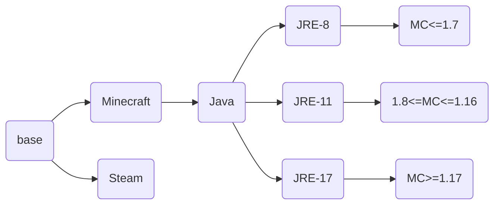

# gameserver-image-stacks

## 我是谁
这是用于构建eoelab中游戏服务器镜像项目  
## 镜像依赖关系
节点内为镜像，默认子节点是父节点的派生  

```mermaid
	graph LR
	A(base)-->B(Minecraft)
	B-->C(Java)
	C-->D(JRE-8)-->G(MC<=1.7)
	C-->E(JRE-11)-->H(1.8<=MC<=1.16)
    C-->F(JRE-17)-->I(MC>=1.17)
    A-->J(Steam)
```
