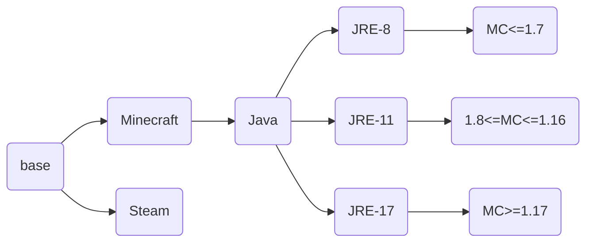

# gameserver-image-stacks
## 如果您通过github访问本项目，请注意
1. github上的仓库是由源仓库推送的镜像仓库，是gitlab的镜像仓库，具体实现可以参考 https://docs.gitlab.com/ee/user/project/repository/mirror/  
2. 我们的源仓库是 https://eoelab.org:1031/build-image-stacks/gameserver-image-stacks  
3. 我们的docker镜像仓库是 https://hub.docker.com/r/ben0i0d/gameserver   
4. 对于issue/PR，我们推荐在源仓库上提，这对于我们工作更方便，但是如果您在github上提，我们也会跟进处理  
## 我是谁
这是用于构建eoelab中游戏服务器镜像项目  
## 镜像依赖关系
节点内为镜像，默认子节点是父节点的派生  

